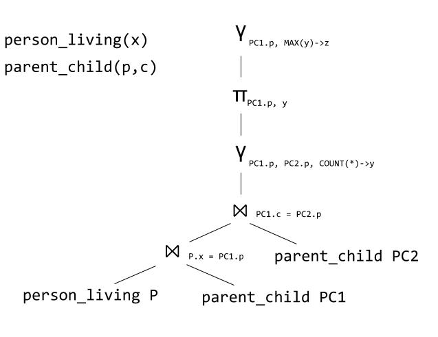

# CS174A Homework 3: Finding the Mitochondrial Eve

**Objectives:**
To understand how queries are translated into the relational algebra. To master writing relational queries in a logic formalism using Datalog.

**Assignment tools:**
Part 1: "pen and paper"; Part 2: Soufflé

**Assigned date:** Thursday, October 21, 2021

**Due date:** Thursday, October 28, 2021, 11:00 PM Pacific Time. You have 1 week for this assignment. Your solutions/files should be uploaded directly to the GradeScope HW3. submission page.

**What to turn in:** `hw3-q1.txt`, `hw3-q2.txt`, and `hw3.dl` (see below).

**Resources:** 

- Soufflé (https://souffle-lang.github.io)
    
- Soufflé [language documentation](https://souffle-lang.github.io/datalog)

- [Soufflé tutorial](https://souffle-lang.github.io/tutorial)

- General information for Part 2:    
    - The [Mitochondrial Eve](https://en.wikipedia.org/wiki/Mitochondrial_Eve)        
    - List of [women in the Bible](https://en.wikipedia.org/wiki/List_of_women_in_the_Bible)         
    - List of [minor biblical figures](https://en.wikipedia.org/wiki/List_of_minor_biblical_figures,_A%E2%80%93K)        
    - Note that the parent-child relationship is randomly generated and may change.


## Assignment Details

### Part 1: Warm Up with Relational Algebra

1. (10 points) Write the equivalent SQL query to the following relational algebra query plan:
 
 
 
 Save your answer in `hw4-q1.txt`. *Remember to follow the same style guide for writing SQL as in HW1 and HW32! (we reserve the right to take off points even if your query returns the correct results)*


2. (10 points) Write a relational algebra plan for the following SQL query:

    ```sql
    SELECT a.x
    FROM   person_living AS a, male AS b
    WHERE  a.x = b.name AND 
           NOT EXISTS (SELECT * 
                       FROM   parent_child AS c, female AS d 
                       WHERE  c.p=d.name AND c.c=a.x)
   ```

    You do not need to draw the query plan as a tree and can use the linear style instead. To make precedence clear, we ask you to break down your query plan by using *at most one* operator on each line.  For example, given the query in question 1, you could write it as:

    ```sh
    T1(P.x,PC1.p,PC1.c) = person_living(x) P Join[P.x=PC1.p] parent_child(p,c) PC1
    T2(P.x,PC1.p,PC1.c,PC2.p,PC2.c) = T1(P.x,PC1.p,PC1.c) Join[PC1.c = PC2.p] parent_child(p,c) PC2
    T3(PC1.p,PC2.p,y) = GroupBy[PC1.p,PC2.p,count(*)->y] T2(P.x,PC1.p,PC1.c,PC2.p,PC2.c)
    T4(PC1.p,y) = Project[PC1.p,y] T3(PC1.p,PC2.p,y)
    T5(PC1.p,z) = GroupBy[PC1.p,max(y)->z] T4(PC1.p,y)
    ```

    where `T1`, `T2`, etc are temporary relations. Note that each line has at most one relational operator. You do not need to use the Greek symbols if you prefer. You also don't need to distinguish among the different flavors of join (just make sure that you write out the full join predicate).  We will be grading this part of the homework manually so don't worry too much about the exact syntax of the relation algebra function names etc, as long as we can tell what is going on.

    Save your answer in `hw3-q2.txt`. 


### Part 2. Finding the Mitochondrial Eve

Every human has a mother, who had her own mother, who in turn had her own mother.  The matrilineal ancestor of an individual consists of the mother, the mothers mother, and so on, following only the female lineage.  A matrilinial common ancestor, MCA, is a matrilinial ancestor of all living humans.  An MCA is very, very likely to exist (why?), and in fact there are many MCAs.  The matrilineal most recent ancestor, or MRCA, is the only individual (woman) who is the MCA of all living humans and is the most recent such.  Who is she?  When did she live? For this assignment we will define "most recent" in terms of the number of generations, since the dates of the individuals are not provided.  

In the 1980s three researchers, Cann, Stoneking and Wilson, analyzed the mitochondrial DNA of living humans and determined that the MRCA lived about 200,000 years ago.  The researchers called her the [Mitochondrial Eve](https://en.wikipedia.org/wiki/Mitochondrial_Eve).

In this homework, you will analyze a database of 800 individuals, compute several things, culminating with the the computation of the Mitochondrial Eve.  The genealogy database consists of over 800 biblical names, obtained from Wikipedia, with a randomly generated parent-child relationship.

### Getting Started

1. Install Soufflé
    1. (Recommended) Use the Home VM or ssh into attu
        * Type `sudo yum install souffle` in a terminal.
    2. If you prefer to install it on your own machine, follow the instructions on the [Soufflé project webpage](https://souffle-lang.github.io/install).

2. Verify Soufflé is working:
    ```
    $ cd hw4/starter-code
    $ souffle hw4.dl
    ```
  
    Congratulations! You just ran your first Datalog query.
    

### Questions
For each question below, write in the file `hw3.dl` a program that computes the answer to that question. *Note that unlike previous homework, we ask you to put your solutions to all problems in a single file, as you will need the output from previous questions.* See the Example section below. Also, we have declared the output predicates (`p1`, `p2`, etc) for you along with a number of `.output` statements. *Do not remove any of them.* 

1. (10 points) Find all descendants of Priscilla and their descriptions.  Name your final output predicate `p1(x,d)`. (123 rows)


2. (10 points) Find the woman/women with the largest number of children and the man/men with the largest number of children. For each individual, you should return the name of that individual, his/her description, and the number of children. Name your predicate `p2(x,d,n)`. (2 rows)


3. (20 points) For each person x, we call a "complete lineage" any sequence x0=x, x1, x2,  , xn where each person is the parent of the previous person, and the last person has no parents; the length of the sequence is n.  If x has a complete lineage of length n, then we also say that "x is in generation n".  Compute the minimum and maximum generation of each living person x. 

    Name your predicate `p3(x,m1,m2)`, where x is a living person, and `m1`, `m2` are the minimal/maximal generation. (Hint: You may want to first compute all generations for all x: think about when can you say that x is in generation 0, and when can you say that x is in generation n+1.  Of course x can be in multiple generations, e.g., x's mother is in generation 0 and x's father is in generation 2.   Once you know everybody's generations, you can answer the problem easily.) (22 rows)

4. (20 points) Compute all matrilineal common ancestors, MCA. Recall that the matrilineal ancesors of 
   person A are the mother of A, the mother of the mother of A, and so on. Name your predicate `p4(x)`.
   (Hint: Compute the pairs of people living and their matrilineal ancestors. If a female is not a 
   matrilineal ancestor to at least one living person, that female is not an MCA.) (6 rows)

5. (20 points) Find the mitochondrial Eve, the most recent MCA. Name your predicate `p5(x)`. 
   Remember that you can utilize your predicates defined earlier. (1 row)


#### Example

For example, suppose the question were: find all children of Priscilla; return their names and their descriptions. Then you write this in the `hw3.dl` file (its already there):

```c
.output p0(IO=stdout)                   // print to terminal
.output p0(filename="hw4-0.ans")        // also output to a file
p0(x,d) :- parent_child("Priscilla",x), person(x,d).  // NOTE the period at the end 
```

  
## Submission Instructions

For Part 1, write your answers in a file `hw3-q1.txt`, and `hw3-q2.txt`.

Write your answers in the provided file `hw3.dl`.

Submit your answers to the GradeScope HW3
