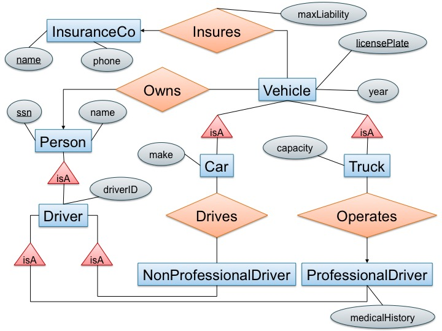

# CMPSC 174A Homework 4: Advanced SQL and ER diagram

**Objectives:**
To practice advanced SQL and ER diagram 

**Assignment tools:**
- Part C: Pen and paper or any drawing tools you prefer (e.g., powerpoint, [draw.io](https://www.draw.io)).

**Assigned date:** Thursday, November 4, 2021

**Due date:** Tuesday, November 18, 2021

**What to turn in:**
A PDF file. The expected output format has been explained in detail under each Part. Please follow the instructions in your submission file.

## Assignment Details

The 1st part(Part A and B) of homework is a continuation of HW2 but with some changes:

- The queries are more challenging

The 2nd part of homework will be on ERD design.

- You have to design some ER diagrams from a system.

### Part A. Ingesting Data (0 points)

Next, you should import all the data from HW2.

The data used in this assignment is the same as that in HW2, in the `flights-small.csv`, `carriers.csv`, `months.csv`, and `weekdays.csv` files.

Do some `SELECT count(*)` statements to check whether your imports are successful.

- Carriers has 1594 rows
- Months has 12 rows
- Weekdays has 8 rows
- Flights has 1148675 rows

Those are basically imported in homework2. If these tables don't exist in your machine, import the flight database again. Instructions for importing can be found in HW2 folder.

### Part B. SQL Queries (35 points):

For each question below, write a single SQL query to answer that question 
(you can use subqueries this time).
For each query, add the following as comments:
* the number of rows your query returns,
* how long the query took, and 
* the first 20 rows of the result (if the result has fewer than 20 rows, output all of them). 

Now answer the following questions:

1. For each origin city, find the destination city (or cities) with the longest direct flight.
By direct flight, we mean a flight with no intermediate stops. Judge the longest flight in 
time, not distance. (15 points)

    Name the output columns `origin_city`, `dest_city`, 
    and `time` representing the the flight time between them. 
    Do not include duplicates of the same origin/destination city pair. 
Order the result by `origin_city` and then `dest_city` (ascending, i.e. alphabetically).

    [Output relation cardinality: 334 rows]

2. Find all origin cities that only serve flights shorter than 3 hours. 
You can assume that flights with `NULL` actual_time are not 3 hours or more. (10 points)

    Name the output column `city` and sort them. List each city only once in the result.

    [Output relation cardinality: 109]

3. For each origin city, find the percentage of departing flights shorter than 3 hours. 
For this question, treat flights with `NULL` `actual_time` values as no longer than 3 hours. (10 points)

    Name the output columns `origin_city` and `percentage`
Order by percentage value, ascending. Be careful to handle cities without any flights shorter than 3 hours. 
We will accept either `0` or `NULL` as the result for those cities.
Report percentages as percentages not decimals (e.g., report 75.25 rather than 0.7525).

    [Output relation cardinality: 327]

## Part C: Theory on ERD (65)

1. (10 points) Design an E/R diagram for geography that contains the following kinds of objects or entities together with the listed attributes. 

    Model the relationships between the objects with edges. Note that edges between entities can be labeled with constraints. Make sure to label only the/those primary key(s) that is/are mentioned below.

    **Entities**
    - countries (with attributes): name, area, population, gdp ("gross domestic product")
      - a country's name uniquely identifies the country within all countries
    - cities: name, population, longitude, latitude
      - a city is uniquely identified by its (longitude, latitude) (not by name, ex:there are 41 different cities and towns named Springfield in the US!)
    - rivers: name, length
    - seas: name, max depth
      - rivers and seas are uniquely identified within all water entities by their name (e.g., "Ganges" would be a unique water entity)

    **Relationships:**
    - each city belongs to exactly one country
    - each river crosses one or several countries
    - each country can be crossed by zero or several rivers
    - each river ends in either a river or a sea

    You can draw your diagrams on paper and scan them, take *quality* pictures of your drawn diagram, or use your favorite drawing tool such as Powerpoint, Keynote, or [draw.io](https://www.draw.io/). (FYI: Google Slides lacks a few shapes that you might need such as rounded arrows... You can use a cresent and a line)

2. (20 points) Consider the following E/R diagram: 

    

    	- 'License plate' can have both letters and numbers;
    	- 'driverID' and 'Social Security' contain only numbers;
    	- 'maxLiability' is a real number;
    	- 'year', 'phone', 'capacity' are integers;
    	- Everything else are strings.

    - (10 points) Translate the diagram above by writing the SQL `CREATE TABLE` statements to represent this E/R diagram. Include all key constraints; you should specify both primary and foreign keys. Make sure that your statements are syntactically correct (you might want to check them using sqlite / Azure for instance).
    - (5 points) Which relation in your relational schema represents the relationship "insures" in the E/R diagram and why is that your representation?
    - (5 points) Compare the representation of the relationships "drives" and "operates" in your schema, and explain why they are different.

3. (20 points) Consider the following two relational schemas and sets of functional dependencies:
    - R(A,B,C,D,E) with functional dependencies D → B, CE → A.
    - S(A,B,C,D,E) with functional dependencies A → E, BC → A, DE → B.

    For each of the above schemas, decompose it into BCNF. Show all of your work and explain, at each step, which dependency violations you are correcting. Make sure you describe each step in your decomposition steps. (10 points each)

4. (15 points) A set of attributes X is called closed (with respect to a given set of functional dependencies) if X+=X. Consider a relation with schema R(A,B,C,D) and an unknown set of functional dependencies. For each closed attribute set below, give a set of functional dependencies that is consistent with it.
    - All sets of attributes are closed.
    - The only closed sets are {} and {A,B,C,D}.
    - The only closed sets are {}, {A,B}, and {A,B,C,D}.

